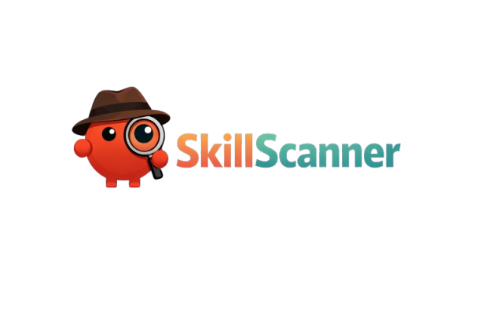

<p align="center">
  
</p>

<p align="center">
  <a href="#quickstart"><strong>Quickstart</strong></a> &middot;
  <a href="https://github.com/patidarganesh/SkillScanner"><strong>GitHub</strong></a>
</p>

<p align="center">
  <a href="https://github.com/patidarganesh/SkillScanner/blob/main/LICENSE"></a>
  <a href="https://github.com/patidarganesh/SkillScanner/stargazers"></a>
</p>

<br/>

<div align="center">
  <video src="static/example.mp4" width="600" controls></video>
  <br/>
  <a href="static/example.mp4"><strong>Watch Demo Video</strong></a>
</div>

<br/>

## What is SkillScan?

# Open-source security analyser for AI skill packages

**If VirusTotal is for _executables_, SkillScan is for _AI skills_**

SkillScan is a Python-based Flask server and beautiful web UI that orchestrates the analysis of AI skill packages natively. Bring your own AI provider, upload an unknown skill package, and trace hardcoded secrets, data exfiltration logic, and structural security threats dynamically.

It looks like a simple uploader — but under the hood it unpacks directories, filters binary files out intelligently, and utilizes state-of-the-art LLMs to perform deep code and configuration audits.

**Manage security risks, not just lines of code.**

|        | Step            | Example                                                            |
| ------ | --------------- | ------------------------------------------------------------------ |
| **01** | Connect AI      | _Set up Anthropic, OpenAI, or pull a local Ollama model._          |
| **02** | Upload package  | Drop a `.zip` file or an entire nested folder structure.           |
| **03** | Review analysis | Read comprehensive security scores, threat vectors, and remediations. |

<br/>

<div align="center">
<table>
  <tr>
    <td align="center"><strong>Works<br/>with</strong></td>
    <td align="center"><br/><sub>Python</sub></td>
    <td align="center"><br/><sub>Node.js</sub></td>
    <td align="center"><br/><sub>JS / TS</sub></td>
    <td align="center"><br/><sub>Web Files</sub></td>
    <td align="center"><br/><sub>Config</sub></td>
  </tr>
</table>

<em>If it can parse as plain text, it's audited.</em>

</div>

<br/>

## SkillScan is right for you if

- ✅ You want to download and run **third-party AI skills** safely
- ✅ You **worry about prompt injection** or deep data exfiltration when trying out new tools
- ✅ You have **complex nested codebases** and don't want to natively review every single script file manually
- ✅ You want analysis running **locally for free** using zero-data-retention models like Ollama

<br/>

## Features

<table>
<tr>
<td align="center" width="33%">
<h3>🔌 Bring Your Own LLM</h3>
Anthropic, OpenAI, Gemini, OpenRouter, or local Ollama. You choose the intelligence that audits.
</td>
<td align="center" width="33%">
<h3>🎯 Comprehensive Scanning</h3>
Parses and understands directory trees implicitly. Captures structural issues automatically.
</td>
<td align="center" width="33%">
<h3>📦 Archive & Folder Extraction</h3>
SkillScan opens everything from archives or folders, skipping `.exe` or images to save context limits.
</td>
</tr>
<tr>
<td align="center">
<h3>🔒 Privacy First</h3>
Fully air-gapped capable with Ollama. No proprietary internal code leaves your servers.
</td>
<td align="center">
<h3>⚡ Native Flask Backend</h3>
Ultra-lightweight backend powered by python.
</td>
<td align="center">
<h3>🎫 Scan Auditable History</h3>
Records every single scan. Trace the timestamp, verdict, and the overarching file structure.
</td>
</tr>
<tr>
<td align="center">
<h3>🛡️ Threat Categorization</h3>
Ranks findings dynamically by risk level: Critical, High, Medium, Low, info. Actionable mitigation steps included natively.
</td>
<td align="center">
</td>
<td align="center">
</td>
</tr>
</table>

<br/>

## What SkillScan is not

|                              |                                                                                                                      |
| ---------------------------- | -------------------------------------------------------------------------------------------------------------------- |
| **Not an antivirus execution lock.**| SkillScan does not block code. It tells you whether it's safe *before* you execute it natively.                      |
| **Not a framework execution.**  | It doesn't run the agents. It validates the code of the agents themselves statically.                            |
| **Not an active firewall proxy.**  | It operates purely as an advisory auditor dashboard.                                                         |

<br/>

## Quickstart

Open source. Self-hosted. Get deployed in seconds.

> **Requirements:** Python 3.8+

###  Windows

```bash
# Clone the repository
git clone https://github.com/patidarganesh/SkillScanner.git
cd SkillScanner

# (Optional) Create and activate a virtual environment
python -m venv venv
venv\Scripts\activate

# Install the native dependencies
pip install -r requirements.txt

# Add your API keys in config.json
notepad config.json

# Run the lightweight UI
python app.py
```

###  macOS

```bash
# Clone the repository
git clone https://github.com/patidarganesh/SkillScanner.git
cd SkillScanner

# (Optional) Create and activate a virtual environment
python3 -m venv venv
source venv/bin/activate

# Install the native dependencies
pip3 install -r requirements.txt

# Add your API keys in config.json
open -e config.json

# Run the lightweight UI
python3 app.py
```

###  Linux

```bash
# Clone the repository
git clone https://github.com/patidarganesh/SkillScanner.git
cd SkillScanner

# (Optional) Create and activate a virtual environment
python3 -m venv venv
source venv/bin/activate

# Install the native dependencies
pip3 install -r requirements.txt

# Add your API keys in config.json
nano config.json   # or: vim config.json

# Run the lightweight UI
python3 app.py
```

This starts the native API server at `http://localhost:5000`. No massive setups required.

<br/>

## Configuration

Before running SkillScan, you need to configure your AI provider in `config.json`.

1. Open `config.json` in the root directory.
2. Set the `"provider"` field to your preferred service (`"anthropic"`, `"openai"`, `"openrouter"`, or `"ollama"`).
3. Fill in your API key in the corresponding section.
4. If using **Ollama**, ensure the Ollama server is running locally.

```json
{
  "provider": "openai",
  "openai": {
    "api_key": "sk-...",
    "model": "gpt-4o"
  }
}
```

<br/>

## FAQ

**Can I run this entirely offline using local models?**
Yes. You can orchestrate local models by launching `ollama` natively, and switching the Application UI parameters directly to point towards it.

**How does the file skipping logic work?**
SkillScanner reads standard `.gitignore` logic dynamically in conjunction with extensions like `.exe`, `.dll`, `.jpg`, `.mp4` natively—blocking them from artificially raising API contexts.

**How accurate are the models?**
The accuracy of the analysis depends heavily on the underlying LLM used. While SkillScan provides the framework for analysis, the quality of threat detection and remediation suggestions is directly tied to the capabilities of the chosen AI model.

<br/>

## Development

```bash
python app.py         # Full native runtime execution on local flask
```

<br/>


## Contributing

We welcome contributions.

<br/>

## License

MIT &copy; 2026 SkillScan

## Star History

[](https://www.star-history.com/?repos=patidarganesh%2FSkillScanner&type=date&legend=top-left)

<br/>

---

<p align="center">
  <sub>Open source under MIT. Built for people who want to understand their AI scripts, not blind execute them.</sub>
</p>
